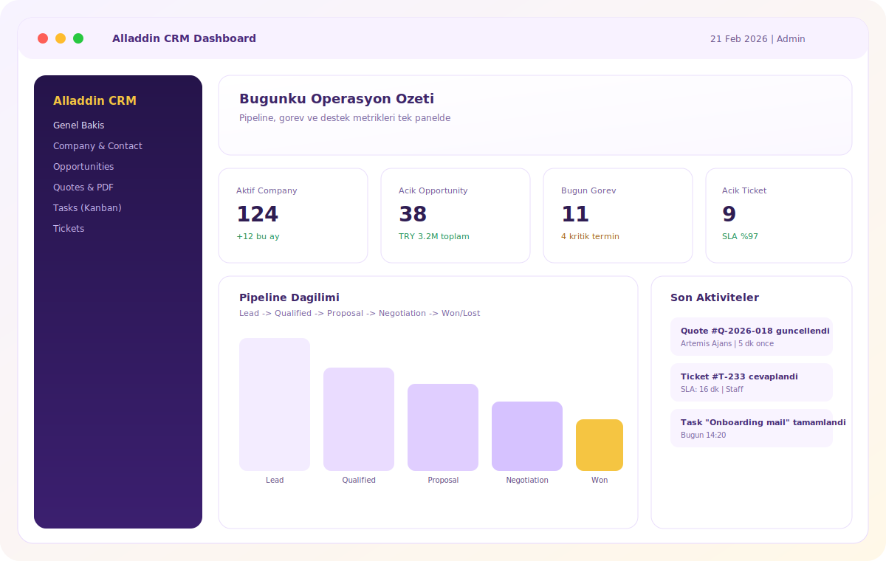
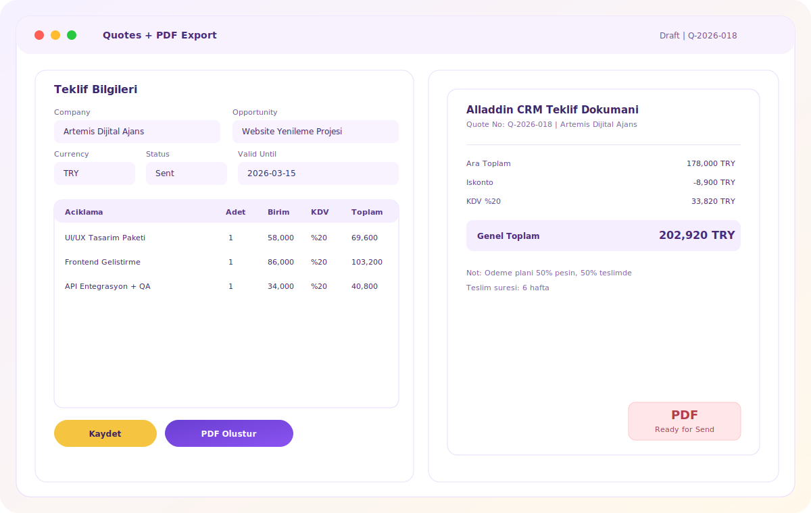
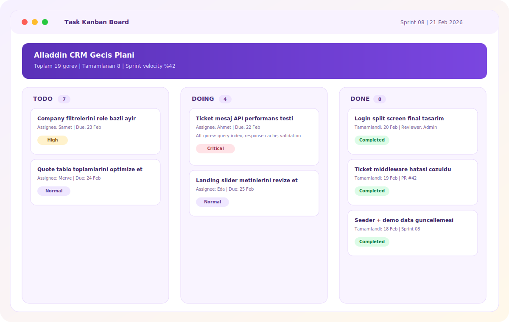
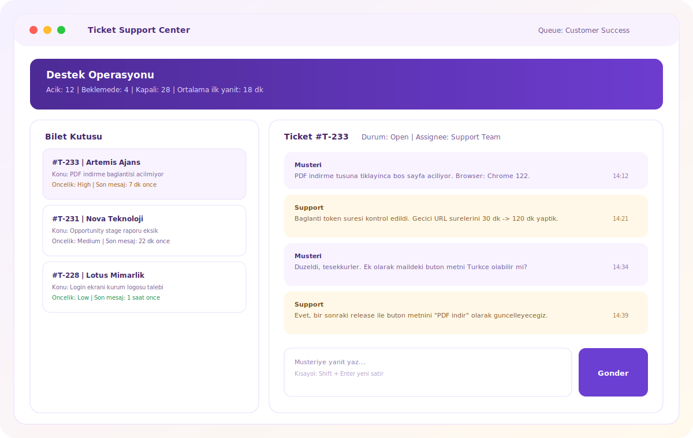

# Alladdin CRM

<p align="center">
  
</p>

<p align="center">
  <a href="https://github.com/aptus0/AladdinCRM/actions/workflows/lint.yml"></a>
  <a href="https://github.com/aptus0/AladdinCRM/actions/workflows/tests.yml"></a>
  <a href="https://github.com/aptus0/AladdinCRM/actions/workflows/release.yml"></a>
  <a href="https://github.com/aptus0/AladdinCRM/releases"></a>
  <a href="LICENSE"></a>
  <a href="https://github.com/aptus0/AladdinCRM/issues"></a>
  <a href="https://github.com/aptus0/AladdinCRM/pulls"></a>
  <a href="https://github.com/aptus0/AladdinCRM/stargazers"></a>
  <a href="https://github.com/aptus0/AladdinCRM/network/members"></a>
  <a href="https://github.com/aptus0/AladdinCRM/graphs/contributors"></a>
  <a href="https://github.com/aptus0/AladdinCRM/commits/main"></a>
  <a href="https://github.com/aptus0/AladdinCRM/labels/good%20first%20issue"></a>
  <a href="CONTRIBUTING.md"></a>
  <a href="https://img.shields.io/badge/PRs-welcome-brightgreen.svg"></a>
  
  
  
  
</p>

Alladdin CRM is a modern full-stack CRM for small teams to manage sales + support operations in one panel:

- Company + Contact management
- Opportunity pipeline
- Quote + PDF export
- Task board (Kanban)
- Ticket + message flow
- Activity log + dashboard metrics

## Live Demo

- Public URL: https://dxx92tlfac.sharedwithexpose.com
- Note: This is an Expose Free tunnel created on February 21, 2026 and may expire.
- Re-open tunnel command:

```bash
expose share aladdincrm.test --server=free
```

## Product Scope (MVP)

- Auth: login/logout, email verification, role support (`admin`, `staff`)
- CRM Core: companies + contacts (search/filter/pagination/soft-delete)
- Sales: opportunities with stage tracking + pipeline summary
- Quotes: quote items, automatic totals, PDF export
- Tasks: Kanban with drag-drop order/status updates
- Support: tickets and threaded ticket messages
- Audit: activity log for key state changes
- Dashboard: due tasks, open tickets, pipeline total, recent activity

Full blueprint: [`docs/alladdin-crm-mvp.md`](docs/alladdin-crm-mvp.md)

## Tech Stack

- Backend: Laravel 12, PHP 8.2+, Fortify auth, Wayfinder
- Frontend: Svelte 5 + Inertia.js 2 + Tailwind CSS 4
- Database: SQLite / MySQL / PostgreSQL
- PDF: quote export endpoint + Blade PDF template
- Tooling: Vite, ESLint, Prettier, Pest/PHPUnit, Pint

## Screenshots

### Dashboard



### Quotes + PDF



### Task Kanban



### Tickets



## Quick Start

### 1) Install dependencies

```bash
composer install
npm install
```

### 2) Environment setup

```bash
cp .env.example .env
php artisan key:generate
```

### 3) Database

For SQLite:

```bash
touch database/database.sqlite
```

Then run migrations + seeders:

```bash
php artisan migrate:fresh --seed
```

### 4) Run application

```bash
composer run dev
```

Alternative split terminal mode:

```bash
php artisan serve
php artisan queue:listen --tries=1 --timeout=0
npm run dev
```

## Demo Accounts (Seeded)

All seeded users use the same password: `password`

- `admin@aladdincrm.test` (Admin)
- `sales@aladdincrm.test` (Staff)
- `staff@aladdincrm.test` (Staff)
- `support@aladdincrm.test` (Staff)
- `ops@aladdincrm.test` (Staff)

Seeder entrypoint: [`database/seeders/DatabaseSeeder.php`](database/seeders/DatabaseSeeder.php)

## API Overview

All API routes are under `/api` and protected by `auth + verified + license middleware`.

- `GET /api/dashboard/metrics`
- `GET /api/system/status`
- `GET /api/opportunities/pipeline-summary`
- `POST /api/tasks/{task}/move`
- `POST /api/tickets/{ticket}/messages`
- `GET /api/quotes/{quote}/pdf`
- CRUD resources:
  - `/api/companies`
  - `/api/contacts`
  - `/api/opportunities`
  - `/api/quotes`
  - `/api/tasks`
  - `/api/tickets`

Route source: [`routes/web.php`](routes/web.php)
System status API docs: [`docs/system-status-api.md`](docs/system-status-api.md)

## Project Structure

```text
app/
  Actions/
  Data/
  Http/
  Policies/
  Services/
resources/
  js/
    components/
    layouts/
    pages/
database/
  migrations/
  seeders/
docs/
```

## Quality Commands

```bash
npm run check
npm run build
composer test
```

## Versioning + Release

- Semantic Versioning: `MAJOR.MINOR.PATCH`
- Set version via `.env`:

```env
APP_VERSION=1.0.0
```

Release example:

```bash
git tag v1.0.0
git push origin v1.0.0
```

GitHub Actions release workflow is available at:
[`/.github/workflows/release.yml`](.github/workflows/release.yml)

## Optional License + Integrity Controls

License/version check env options:

```env
ALLADDIN_LICENSE_KEY=
LICENSE_CHECK_ENABLED=false
LICENSE_ENFORCE=false
LICENSE_VERIFY_URL=
LICENSE_CACHE_MINUTES=10
LICENSE_TIMEOUT_SECONDS=3
APP_VERSION_CHECK_URL=
APP_VERSION_CACHE_MINUTES=30
APP_VERSION_TIMEOUT_SECONDS=3
```

Integrity snapshot/check:

```bash
php artisan app:integrity:snapshot
php artisan app:integrity:check
```

Details: [`docs/open-source-model.md`](docs/open-source-model.md)

## Contributing

- Use conventional commits (`feat:`, `fix:`, `refactor:`, `docs:`, `test:`, `chore:`)
- Keep controllers thin, business logic in service/action layer
- Add tests for behavior changes
- Read the full guide: [`CONTRIBUTING.md`](CONTRIBUTING.md)
- Open issue templates: [Bug](.github/ISSUE_TEMPLATE/bug-report.yml), [Feature](.github/ISSUE_TEMPLATE/feature-request.yml), [Task](.github/ISSUE_TEMPLATE/task.yml), [Docs](.github/ISSUE_TEMPLATE/documentation.yml)
- Ready issue pool for maintainers: [`docs/issue-backlog.md`](docs/issue-backlog.md)

## License

Released under the MIT License. See [`LICENSE`](LICENSE).
